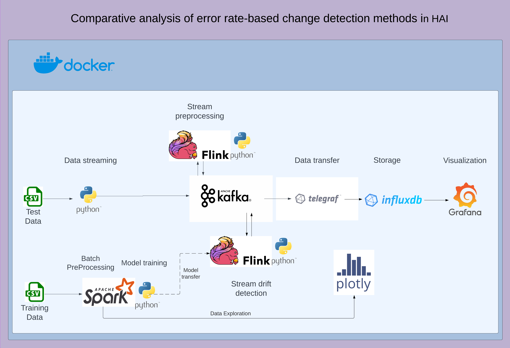

# OST project

## Overview 
This OST & SM project aims to conduct a comparative analysis of error rate-based change detection methods using the HAI dataset.
The overall tasks include importing data from a CSV file, streaming line-by-line to Kafka, implementing different change detection algorithms, storing the data and results in InfluxDB, and presenting the data and results using Grafana.

## Architecture
In the image below, the architecture of the project:

## Detail documentation
Detailed documentation on the project can be found in the pdf within this folder.

## My tasks 
### Stream mining situation
Since I did not take the stream mining course, my assignments were related to using the open source technologies I had learned in the OST course.

This is and was quite limiting, because the goal of the project was the comparative analysis of stream mining algorithms, and although at first I tried to build some algorithms,
I found myself unprepared for the proper implementation of these and their evaluation.
In any case, a draft of my work can be found in the file drift_change_detection.ipynb.

### Workfolw
So I organized my work around the use of the static dataset, implementing:
- docker 
- batch processing
- data analysis 
- data preprocessing
- data visualization
- ingesting data into InfluxDB (both with Telgraf and Python framework)
- understanding of Kakfa
- training and evaluating ML model

## About the branches
I want to maintain two branches:
- "oldVersionEmma" is the result of all the branches and commits I made during this project. I had several problems on the day of submission, but now (22/12) I have handled 
the situation by resolving all the conflicts and merging all the branches into this one.
- "finalVersionEmma" is a new branch I created for the submission, which has all the files and configuration well prepared for the project defense.
